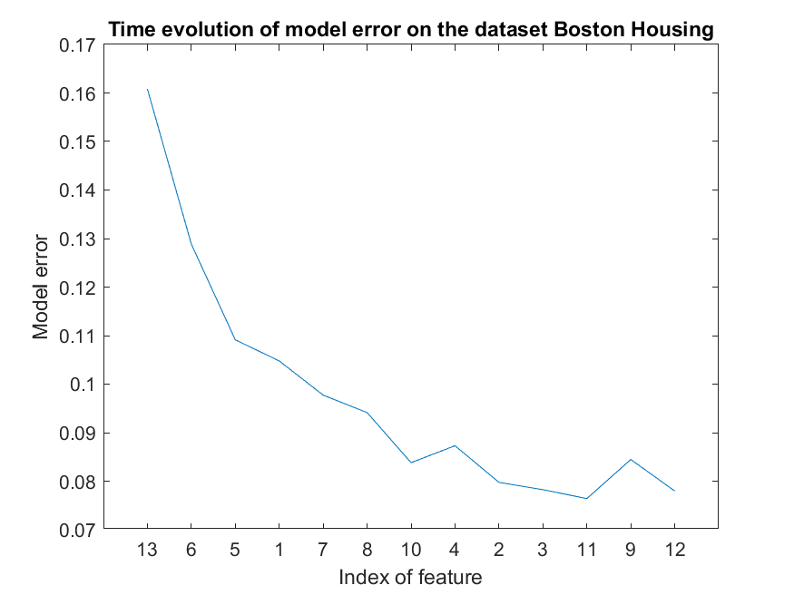

# AHFS
 **Adaptive Hybrid Feature Selection (AHFS)**

## Short description
This directory contains the MATLAB code for the Adaptive Hybrid Feature Selection (AHFS) algorithm. The related scientific publication, describing the algoritm, has been published in the Pattern Recognition journal (https://www.journals.elsevier.com/pattern-recognition) and it can be found through the link below, it is an open access manuscript accessible by anyone: https://www.sciencedirect.com/science/article/pii/S0031320321001199.
If using the published code, please, refer to this publication and please, shortly inform about the reference: viharos.zsolt@gmail.com. Thank you.

The AHFS solution deals with the problem of integrating the most suitable feature selection methods for a given problem in order to achieve the best feature order. A new, adaptive and hybrid feature selection approach was realised, which combines and utilizes multiple individual methods in order to achieve a more generalized solution, called Adaptive Hybrid Feature Selection (AHFS):
**A** - Adaptivity of the proposed algorithm is realized in such a way that at an individual step of the feature selection algorithm it iterates not only in the space of the variables but in the space of available features selection techniques, too. This is the core idea of the solution.
**H** - Hybrid solution is realised which combines the given, available (supervised) feature selection techniques that have their own specific, but fixed feature evaluation measures/metrics.
**F** - Feature
**S** - Selection
The published code contains the MATLAB implementation of the algorithm described in the linked publication. The code exploits the parallel computing capabilities of the running machine, however, still it is relatively time consuming (see the paper about these measurements).

In the paper, various state-of-the-art feature selection methods are presented in detail with examples of their applications. An exhaustive evaluation was conducted to measure and compare their performance with the proposed AHFS approach. Results prove that while the individual feature selection methods may perform with high variety on the test cases, the combined AHFS algorithm steadily provides noticeably better solution.

Enjoy using the AHFS solution.

## Guidelines for using the code

The "zeroth step" when running the algorithm is to add the following folders to the MATLAB path: feasel, informationtheory, model, other.

After the appropriate data preparation (see the explanation of the input parameters), the algorithm can be run with the following function call:

[already\_selected, algorithm\_chosen, minError, 
    allT\_allSel, allT\_allError] = **ahfs**(D\_n, D\_n\_d, T\_n, T\_n\_d, varargin)

**Input parameters:**

* D\_n: Feature matrix, which is an n-by-m matrix, where n is the number of samples, m is the number of features. It can be normalized (with the help of /other/normalizer.m), but it is not neccessary, because data is normalized directly before ANN training.
* D\_n: Discretized (/other/discretize.m) feature matrix. We usually set the number of bins to 21.
* T\_n: Target matrix, in which every column corresponds to a different target. 
* T\_n\_d: Discretized target matrix, in which every column corresponds to a different target. The number of bins can be e.g. 21.
* varargin: A number of optional parameter can be given, see the docstring of /feasel/ahfs.m regarding these parameters. Every optional parameter has a default value which is overwritten by the user specified value (this is done with the help of /other/parseargs.m). The most important optional parameters: nfeatures (integer, the number of features which are the most important), keepin (cell array, every cell contains the indices of features to be kept in, in the form of a row vector), keepout (cell array, every cell contains the indices of features to be kept out, in the form of a row vector)

_**Important note: The code can now handle only one target, so T\_n and T\_n\_d shall contain only one column, and every input parameter of the form of cell array should be 1-by-1 cell.**_

**Output variables:**

* already\_selected: Matrix containing the feature order.
* algorithm\_chosen: Cell array, in which every cell contains the best algorithms for each step. Every cell corresponds to another target (but keep the note above in mind).
* minError: Matrix containing the minimal errors at each step. It is of size n-by-m, where n is the number of features selected and m is the number of different filter algorithms.
* allT\_allSel: Matrix containing the index of feature chosen by each algorithm at each step. It is of size n-by-m, where n is the number of features selected and m is the number of different filter algorithms.
* allT\_allError: Matrix containing the model error achieved by each algorithm at each step. It is of size n-by-m, where n is the number of features selected and m is the number of different filter algorithms.

## Running the algorithm on a demo dataset

The chosen demo dataset is Boston Housing, which consists of 13 features. AHFS can be executed by running the first section of the script in ahfs_test.m.
The time evolution of the model error can be plotted by running the second section. The result can be seen in the figure below.

Runtime approximately equals 40 seconds using Intel Core i7-9750H CPU @2.60GHz (running the algorithm is a CPU intensive process).

